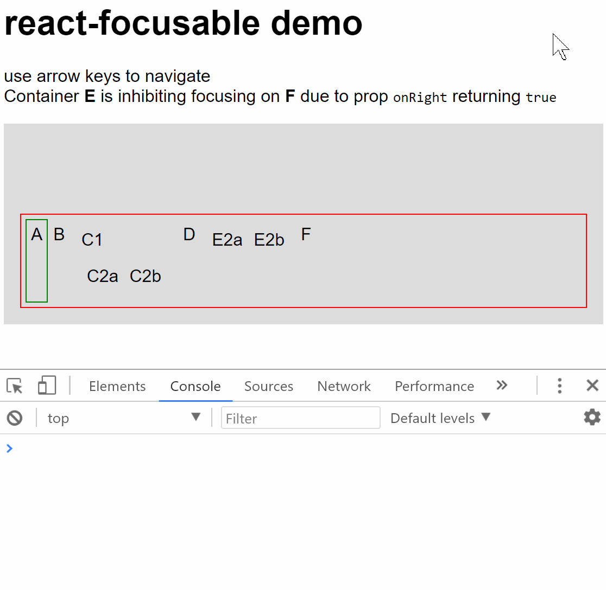

# react-focusable

_WORK IN PROGRESS_

Trying to manage keyboard navigation hierarchically with React alone!

The use case for this solution is smart tvs and consoles.

Spawn one instance of `FocusableRoot` somewhere.  
It must have at most 1 direct focusable (makes sense it is a focusable container. These exist now: `FocusableVerticalList` or `FocusableHorizontalList`).  
You can compose containers as needed and represent leaf notes (bottons, packshots, etc) via `FocusableLeaf`s.  
Containers can be given props `onUp`, `onDown`, `onLeft`, `onRight`. These receive direction when no natural child can. If true is returned, the direction is exhausted there, instead of being passed to the parent.
Created `FocusableDebugger` because why not? Displays received `delta` direction, which is renders as an arrow emoji.

## TODO

* create `FocusableGrid` (received `itemsPerRow`)
* create `FocusableSpacial` (selecting chidren based on spacial position)
* create a simple way of delegating control to a different part of the tree (this one is hard...)
* would be great to refocus on mouse enter too (to seamlessly move from mouse to keyboard/remote)
